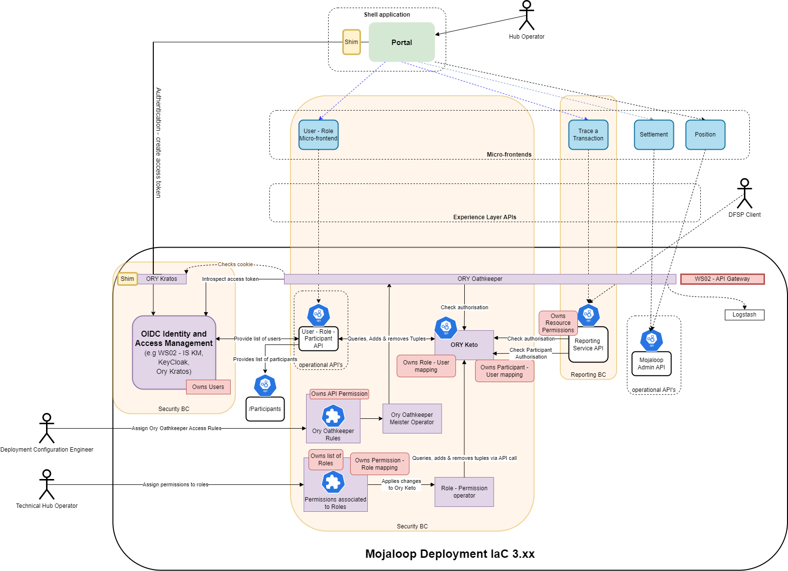

# Security bounded context implementation
## Introduction to security bounded context
The security bounded context (BC) refers to the [bounded security domain](https://ref-arch-docs.moja-lab.live/refarch/boundedContexts/security/) as defined in the reference architecture documentation.
To meet the security objectives of this framework, part of the security bounded context of the reference architecture has been implemented. This guide outlines the high-level design and explains the thinking that went into the design.

The security design:
1. implements role based access control to the current Mojaloop version
1. is compatible with the reference architecture and therefore future versions of Mojaloop
1. is compatible with future Infrastructure-as-Code (IaC) deployments
1. provides activity logging that can be used in an audit

## Tools / standards chosen
Here is a list of standard tools that have been chosen to implement the design.
1. **Ory Oathkeeper** 
Will be used as the Identity and Access Proxy (IAP) that will check authentication and authorization before providing access to functional endpoints, that is, it will be used to enforce the access control.
2. **Ory Keto** 
Will check authorization via subject-role and role-permission mappings. It uses a flexible object-, relationship-, and subject structure pioneered at Google that can model many authorization schemes, including Role Based Access Control (RBAC).
3. **Ory Kratos** 
Will use Ory Kratos to create and manage the cookie authorization object.
4. **OpenID Connect** 
Is the standard that has been chosen to interact with an identity management system. This is a widely supported standard, and is compatible with all the tools currently in use in the Mojaloop community, that is, WSO2 Identity Server (IS), Keycloak, and Ory Kratos.

## Architecture overview
Here is a high-level architecture overview of the implementation of this security bounded context onto the current Mojaloop version.



Here is a table of the services and the roles they are playing.
| Service | Owns | Implements |
| --- | --- |
|**WSO2 IS KM**|Users| 1. User login redirection and UI that creates the cookie token <br>2. Standard OpenID Connect (OIDC) authorization code flow |
|**Ory Keto**|1. The roles mapped to users <br> 2. The participant mapped to users| 1. API RBAC authorization check through Oathkeeper<br>2. API RBAC authorization check through operational API call|
|**Ory Oathkeeper**|The permissions related to API access | API gateway for operational APIs with authentication and authorization checks|
|**Ory Kratos**|Nothing|Authentication cookie|
|**BC Operational API**|The permissions related to the operational API calls|Operational API functions|
|**Shim**| nothing | Redirect to configure OIDC|
|**Operator Role**| Nothing | Update Keto to reflect role-permission assignment changes made in the role-resource file|
|**Kubernetes role-resource file**| The roles and the role-permission assignments| Edits of this file are controlled through a version control implementaiton (for example, GitHub or GitLab).|
|**Roles API**|Nothing|1. Role-user API controls <br>(list of users, list of roles, list of roles assigned to users, add role to user, remove role from user)<br> 2. Participant-user API controls <br>(list of users, list of participants, list of participants assigned to user, add participant to user, remove participant from user)|

## Alignment with the reference architecture
The following overview diagram illustrates how the design conforms with the reference architecture. Some fuctions have been implemented, while others have notyet been implemented, see the details below.

 

### Functions implemented
The implementation of the security BC takes advantage of standard security tools available. In the case where a reference architecture function is alrealy implemented by the chosen standard tool, then it was decided to use that tool's function. Where that was done, a reference to the appropriate tool is made.
1. **Create users / apps / groups** 
The creation of users, groups, and application identity accounts should be done directly in the chosen Identity and Key Management solution being used. In the IaC 3.xx version deployment of Mojaloop, this is the WSO2 Identity Server as a Key Manager (IS-KM) module.
2. **Login** 
A cookie-based authentication token has been implemented, and this funcitonallity is performed by both Ory Kratos (which manages the cookie) and the Identity and Key Management system (which creates the authentication token).
3. **Assign users / apps / groups to roles** 
The assignment of user, group, and app identity accounts to roles is performed by the backend Role API (which makes the relevant changes to Keto).
4. **Create roles and assign privileges to roles** 
The assignment of permissions or privileges to roles is performed by changes to the `roleresource.yml` files. A version control system, for example GitHub, is the control mechanism for changes made to this file. Changes to the file are uploaded to Keto via the Kubernetes role operator.

### Functions not implemented
1. **Communicate permissions/privileges** by each BC on startup.
This is not implemented.
2. **BC login**
This refers to the logging in of each bounded context as they start up. Currently no bounded context has implemented this functionality, so this requirement has not been implemented either.
3. **BC setup callback**
There is no requirement for this if each BC does not login. This has not been implemented.

### Additional functionality
1. **BC verify claim** 
By this we are referring to the ability of a bounded context, that is, implementing an operational API to be able to query if the provided token has authorization to a defined permission or privilege.
This was not a requirement specified by the reference architecture, however it was a requirement to fulfill the generic reporting BC API. This functionality has been made available and is implemented using a standard Keto API.
2. **Assignment of participant access**
In order to implementent external APIs to participant DFSPs, an aditional permission assignment was added where participant access is added to identity accounts. This has been implemented in Keto and maintained through the Roles API. Checking access is through a standard Keto API call.

## Alignment with IaC 4.xxx
Here is a diagram illustrating how the high-level architecture would look if this security bounded context implementation design was implemented on the next IaC version (IaC 4.xxx version) that uses Keycloak and Ambassador / Envoy amongst other changes.

  

## Logging into the UI
This sequence diagram illustrates the events that occur when a brower attemps to access a backend API. 
- If the browser is already logged in, then the request is forwarded. 
- If the brower is not logged in, then a standard OIDC authorization flow is triggered starting with a redirect.

 

## Querying data using the BC operational API micro-frontend
The following sequence diagram shows more details regarding interactions when:
- the bearer token is valid or invalid
- authorization passes or fails

The micro-frontend is represented as a client.

 

In some cases there might be a requirement for a more detailed authorization check to be performed by the operational API. The next sequence diagram describes how that is implemented.

It is important to note that not all operational APIs will require this level of authorization, and that the Oathkeeper control may or may not be required in this use case.

 

## Assigning roles and participant access to users
This functionality is implemented in the Roles API service. The following sequence diagram describes how the user role and user participation access is queried and modified through the Roles API. 
 

### Roles API
The following table provides a summary of Roles API resources.

|Category|HTTP method|Endpoint| Description|Error codes|
| --- | --- | --- | --- | --- |
|**HEALTH**| | | | |
| | GET | /health | Used to return the current status of the API | 400, 401, 403, 404, 405, 406, 501, 503 |
| | GET | /metrics | Used to return metrics for the API | 400, 401, 403, 404, 405, 406, 501, 503|
|**PARTICIPANTS**| | | | |
| | GET | /participants | Used to return a list of participant IDs | 400, 401, 403, 404, 405, 406, 501, 503|
|**ROLES**| | | | |
| | GET | /roles | Used to return a list of role IDs |400, 401, 403, 404, 405, 406, 501, 503 |
|**USERS**| | | | |
| | GET | /users | Used to return a list of user IDs | 400, 401, 403, 404, 405, 406, 501, 503|
| | GET | /users/{ID} |  Used to return a specifc user |400, 401, 403, 404, 405, 406, 501, 503 |
| | GET | /users/{ID}/participants | Used to return a list of participants assigned to a user |400, 401, 403, 404, 405, 406, 501, 503|
| | PATCH | /users/{ID}/participants | Used to assign a participant to a user | 400, 401, 403, 404, 405, 406, 501, 503|
| | GET | /users/{ID}/roles | Used to return a list of roles assigned to a user|400, 401, 403, 404, 405, 406, 501, 503 |
| | PATCH | /users/{ID}/roles | Used to assign a role to a user|400, 401, 403, 404, 405, 406, 501, 503 |


The detailed specification of the Roles API can be found [here](https://docs.mojaloop.io/role-assignment-service/
).
The GitHub repository of the role assignment service can be found [here](https://github.com/mojaloop/role-assignment-service).

## Assigning permissions to roles
The permission to role assignment is stored in a `.yml` file that we are calling a role-resource file (`roleresource.yml`). 
Access and changes to these role-resource files will be managed through a hosted version control solution like GitHub or GitLab. This is convenient as this keeps a full history of changes and has configurable automatic and manual control points.
These role-resource files are mapped as Kubernetes custom resource definitions (CRDs) to which a role-permission operator subscribes. Changes to the role-resource files trigger the role-permission operator to update Ory Keto with the corresponding appropriate change. A role can be represented by more than one file if necessary.

Here is an example of a role-resource file:
```yml
apiVersion: "mojaloop.io/v1"
kind: MojaloopRole
metadata:
  name: arbitrary-name-here
spec:
  # must match what is used in Keto, whatever that is
  role: RoleIdentifier
  permissions:
  - permission_01
  - permission_02
  - permission_03
  - permission_04'
```
The following sequence diagram illustrates how Ory Keto is updated.


## Ory Keto – implementation detail
Ory Keto in this design is the tool that implements the logic of whether a login token has the correct authorization to access an aspect of the system, that is, it is used to enforce RBAC. There are three parts to how this is implemented in Keto:
1. The assignment of roles to users.
This functionality will be maintained and updated from the Roles API module, which will call and update Keto accordingly.
2. The assignment of participant access to a user. 
This refers to the DFSP access reports that must only be provided for the configured participants.
This functionality will also be maintained via the Roles API module, which will call and update Keto accordingly. 
3. The assignment of permissions or privileges to roles. 
This will be controlled through the edits of a GitHub `roleresource.yml` file. The Kubernetes role-permission operator is the service that will monitor these role-resource files, and update Keto to affect the assignments.

### Adding roles and participant access to users in Keto
The user list (which includes both people and service accounts) will be retrieved from WSO2 Identity Server, and the participant list from the existing API for that purpose. In both cases, a durable permanent identifier should be what is then used as part of the Keto calls.

The list of roles will be hardcoded, and every role should be given a unique short identifier that is human readable and writeable, as well as a name. The UI should display both the identifier and the name, since the identifier will be needed for use in the role-permission operator.

There will be two Keto namespaces used for calls: role and participant. The Keto tuples used will be: 
```
role:ROLEID#member@USERID and participant:PARTICIPANTID#member@USERID 
```
(using the notation used for [Keto/Zanzibar](https://www.ory.sh/keto/docs/concepts/relation-tuples)

The reuse of the relation `"member"` is not an issue, each relation is namespace-specific. If there is a preferred term for the participant-user relationship other than `"member"`, that word can be used instead, and should be documented here.

To retrieve the role or participant list for a particular user, the [Query Relation Tuples API](https://www.ory.sh/keto/docs/reference/rest-api#query-relation-tuples) will be used, and the namespace, relation, and subject provided as parameters. This will provide a list of tuples in the response, with a next page token if there are additional results, and the identifiers for the participants or roles can be read from the resulting tuples.

When a role or participant is added or removed for a user, the [create](https://www.ory.sh/keto/docs/reference/rest-api#create-a-relation-tuple) and [delete](https://www.ory.sh/keto/docs/reference/rest-api#delete-a-relation-tuple) relation tuple calls can be used, since only a single tuple is involved at a time. If the call fails, but the failure is not an HTTP 4xx, it should be retried a couple of times.

Here is an example of the Keto API call used to add roles to users.
::: tip Example: Assign role to user in Ory Keto
PATCH /relation-tuples HTTP/1.1
Content-Type: application/json
Accept: application/json
:::

```json 
[
  {
    "action": "insert",
    "relation_tuple": {
    "namespace": "role",
    "object": "RoleIdentifier",
    "relation": "member",
    "subject": "userIdentifier"
    }
  }
]
```
On success, an HTTP 204 message is returned with no content.

::: tip NOTE
We use `"member"` as the `"relation"` in our current implementation.
We use `PATCH` instead of `PUT` since `PATCH` works as a bulk create and/or delete.
:::

### Adding permissions or privileges to roles in Keto
Adding permissions or privileges to roles in KetoThis will be done via a Kubernetes operator for a Custom Resource Definition [(CRD)](https://kubernetes.io/docs/tasks/extend-kubernetes/custom-resources/_print/). The operator could be implemented in most any language. Existing ModusBox operator expertise is mostly based around `kopf`, a Python framework, but there are options in Go and Node as well (and others).

The operator should maintain a memory of all resources it manages, grouped by role. [Kopf's indexing](https://kopf.readthedocs.io/en/latest/indexing/) functionality is ideal for this. 

When a role resource is changed, the list of permissions for that role across all role resources should be compiled, and a change sent through the Keto Patch [Multiple Relation Tuples API](https://www.ory.sh/keto/docs/reference/rest-api#patch-multiple-relation-tuples) using the patch actions `insert` and `delete`. It is necessary to take all role resources into account, because there may be multiple resources for one role, and more than one may include the same permission, so deleting a role resource that maps Role X to Permission P does not necessarily mean that the Keto tuple for that role-permission connection needs to be deleted, since there may still be another role resource mapping Role X to Permission P.

The Keto tuples will be of the form: 
```
permission:PERMISSIONID#granted@role:ROLEID#member
```

The specific operations on resource change are as follows:

1. Retrieve current permissions granted for role using the [Query Relation Tuples API](https://www.ory.sh/keto/docs/reference/rest-api/#query-relation-tuples).
2. Based on stored index of roles to permissions, compute a diff from the retrieved list.
3. Execute patch from diff.
4. If there are problems, throw an exception so the problem will log and a re-sync will be attempted later.


Here is an example of the Keto API call used to add permissions to roles.
::: tip Example: Assign permission/privilege to a role in Ory Keto
PATCH /relation-tuples HTTP/1.1
Content-Type: application/json
Accept: application/json
:::

```json
[
  {
  "action": "insert",
  "relation_tuple": {
    "namespace": "permission",
    "object": "permissionIdentifier",
    "relation": "granted",
    "subject": "role:x#member"
  }
  }
]
```
On success, an HTTP 204 message is returned with no content.

::: tip NOTE
We use `"granted"` as the `"relation"` in our current implementation.
We use `PATCH` instead of `PUT` since `PATCH` works as a bulk create and/or delete.
:::

### Calling the standard Keto API to check authorization
Checking to see if a user has authorization for a privilege or permission is managed by th API gateway, and if necessary can be checked by each bounded context.

Here is an example of the Keto API call used to check for a user's authorization based on a permission/privilege.
::: tip Example: Checking for authorization in Ory Keto
POST /check HTTP/1.1
Content-Type: application/json
Accept: application/json
:::
```json
{
  "namespace": "permission",
  "object": "PermissionIdentifier",
  "relation": "granted",
  "subject": "UserIdentifier"
}
```
Here is the response that comes back:
```json
{
"allowed": true/false
}
```
