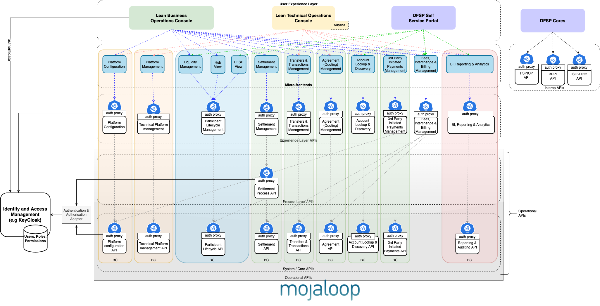
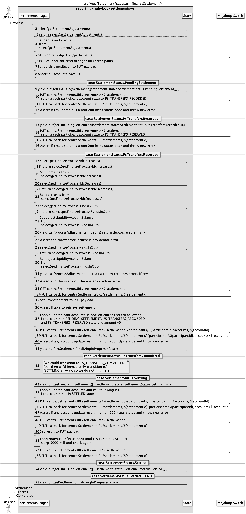

# Settlement Operational Implementation

## Introduction

The objectives of this implementation is to provide a solution to Settlements that supports the core-settlement operations and the high-level settlement business process functions. This guide outlines the high-level design and explains the thinking that went into the design.

## Core-Settlement Operations

This is the existing Settlement functionality provided by the supporting [Central-Settlement](https://github.com/mojaloop/central-settlement) Mojaloop Core component. Detailed information can be found in the [Mojaloop Technical Overview Documentation](https://github.com/mojaloop/documentation/tree/master/legacy/mojaloop-technical-overview/central-settlements).

The Core-Settlement operations support the following capabilities:

- Create a Settlement Matrix Report based on a list of Settlement-Windows
- Process Settlement Acknowledgements for an existing Settlement Matrix Report
- Manage Settlement-Windows (i.e. Create, Close, etc)
- Queries for Settlement Matrix Reports, Settlement-Windows, etc

The OpenAPI definition is available at the [Mojaloop-Specification repository](https://github.com/mojaloop/mojaloop-specification/tree/master/settlement-api).

## High-level Settlement Business Process

This is a process that relies on the existing core-settlement operations to orchestrate the following capabilities:

- Settlement Initiation
- Settlement Finalization
- Settlement Account Balance Adjustments

## High-level Architecture

## Detailed Sequence Diagram

_Note: this is a placeholder for the detailed sequence diagram_

